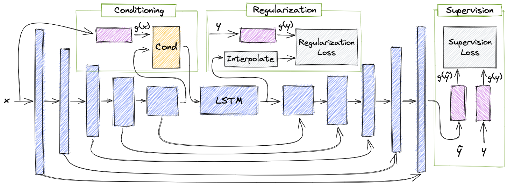

# A Systematic Comparison of Phonetic Aware Techniques for Speech Enhancement @ Interspeech2022
This is a PyTorch implementation of the pipeline presented in [A Systematic Comparison of Phonetic Aware Techniques for Speech Enhancement](put link) 
paper published @ Interspeech2022.

## Paper
[A Systematic Comparison of Phonetic Aware Techniques for Speech Enhancement](put link)<br>
[Or Tal](link to scholar), [Moshe Mandel](link to linkedin), [Felix Kreuk](https://scholar.google.co.il/citations?user=UiERcYsAAAAJ&hl=en), [Yossi Adi](https://scholar.google.co.il/citations?user=4W-HuYYAAAAJ&hl=en)<br>
[23rd INTERSPEECH conference](https://interspeech2022.org/)<br>
Audio samples could be found in our [Project Page](put link)<br>
<br> 
Speech enhancement has seen great improvement in recent
years using end-to-end neural networks. However, most models are agnostic to the spoken phonetic content. <br> 
Recently, several studies suggested phonetic-aware speech enhancement,
mostly using perceptual supervision. 
Yet, injecting phonetic features during model optimization can take additional forms
(e.g., model conditioning). <br> 
In this paper, we conduct a systematic comparison between different methods of incorporating phonetic information in a speech enhancement model.<br> 
By conducting a series of controlled experiments, we observe the
influence of different phonetic content models as well as various feature-injection techniques on enhancement performance,
considering both causal and non-causal models. <br> 
Specifically, we evaluate three settings for injecting phonetic information,
namely: i) feature conditioning; ii) perceptual supervision; and
iii) regularization. <br> 
Phonetic features are obtained using an intermediate layer of either a supervised pre-trained Automatic
Speech Recognition (ASR) model or by using a pre-trained
Self-Supervised Learning (SSL) model. <br> 
We further observe the effect of choosing different embedding layers on performance,
considering both manual and learned configurations. 
Results suggest that using a SSL model as phonetic features outperforms the ASR one
in most cases. 
Interestingly, the conditioning setting performs best among the evaluated configurations.
[Paper](put link).<br><br>


<br><br>
## Cite
If you find this implementation useful please consider citing our work:
```
Add paper citation here
```

## Usage

### Clone the repository
```
git clone https://github.com/slp-rl/SC-PhASE.git
cd SC-PhASE
```

#### Installation
`pip install -r requirements.txt`.

Note: torch installation may depend on your cuda version. see [Install torch](https://pytorch.org/get-started/locally/)

#### Data preprocessing
1. Download all and unzip the [Valentini dataset](https://datashare.ed.ac.uk/handle/10283/2791) 
2. Down-sample each directory using:<br>`bash data_preprocessing_scripts/general/audio_resample_using_sox.sh <path to data dir> <path to target dir>`
3. Generate json files:<br>`python data_preprocessing_scripts/speech_enhancement/valentini_egs_script.py --project_dir <full path to current project root> --dataset_base_dir <full path to the downsampled audio root, containing all downsampled dirs> --spk <num speakers in {28,56}, default=28>`
<br><br>
Note: valentini_egs_script.py assumes that following dataset structure:<br>
```
root dir
│
└─── noisy_trainset_{28/56}spk_wav
│   └─  Downsampled audio files
│
└─── clean_trainset_{28/56}spk_wav
│   └─  Downsampled audio files
│
└─── noisy_testset_wav
│   └─  Downsampled audio files
│
└─── clean_testset_wav
    └─  Downsampled audio files
```

#### Download pretrained HuBERT model weights
1. Download pretrained weights [link](https://github.com/facebookresearch/fairseq/blob/main/examples/hubert/README.md)
2. Copy full path to the pretrained .pt file to `features_config.state_dict_path` field in: configurations/main_config.yaml

### Train
Example of running commands could be found in: run_commands_examples/<br>
Train Demucs(hidden:48, stride:4, resample:4) baseline example:
```
python train.py \
dset=noisy_clean \
experiment_name=h48u4s4_baseline \
hidden=48 \
stride=4 \
resample=4 \
features_dim=768 \
features_dim_for_conditioning=768 \
include_ft=False \
get_ft_after_lstm=False \
use_as_conditioning=False \
use_as_supervision=False \
learnable=False \
ddp=True \
batch_size=16
```

### Test
Test the whole pipeline for a single epoch:<br>
`python train.py dset=debug eval_every=1 epochs=1 experiment_name=test_pipeline`
